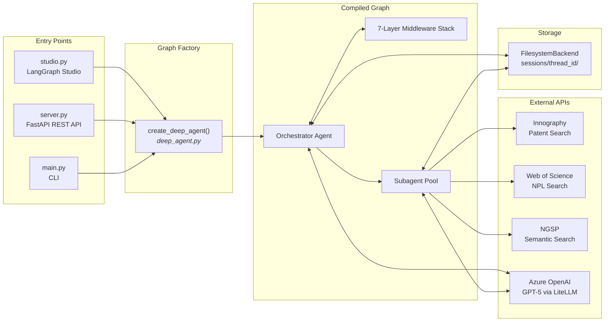
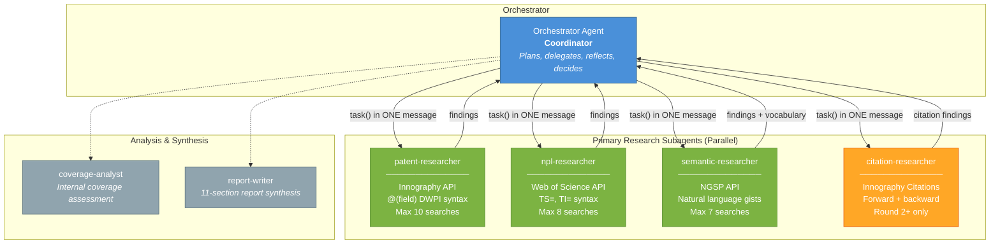
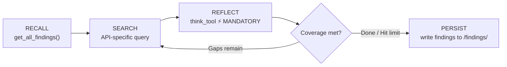
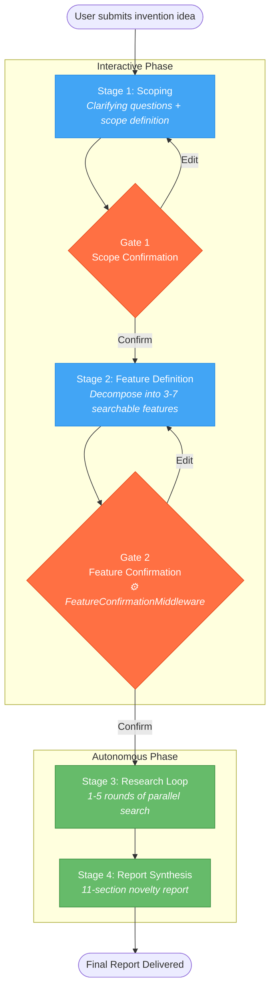
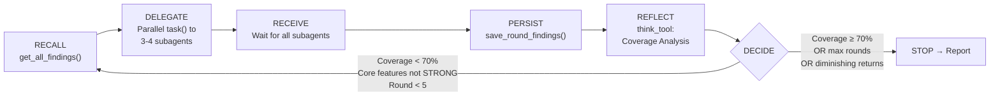
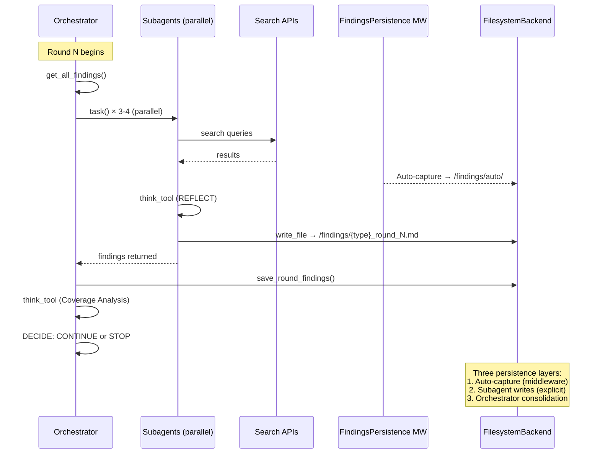
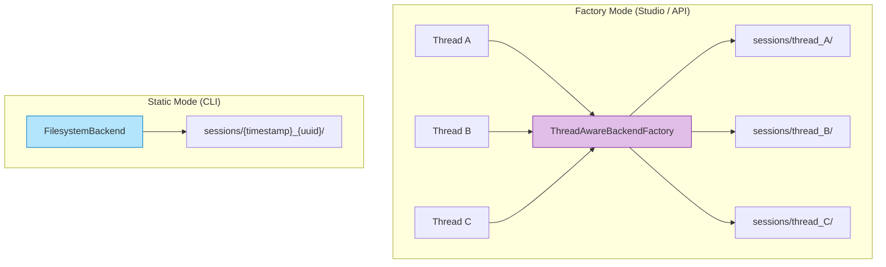
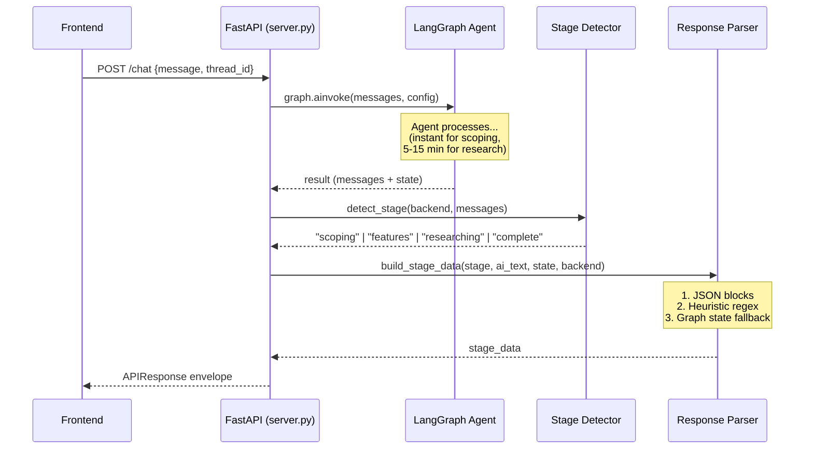

# Novelty Checker — Architecture Overview

> **Visual architecture guide for the dev team.** For detailed implementation reference, see [ARCHITECTURE.md](./ARCHITECTURE.md).

The Novelty Checker is a **hierarchical multi-agent system** that automates patent novelty assessment. It orchestrates parallel searches across patent databases (Innography), academic literature (Web of Science), and semantic indices (NGSP), then synthesizes a comprehensive 11-section novelty report.

---

## 1. System Overview



### Tech Stack

| Layer | Technology |
|-------|-----------|
| Orchestration | **LangGraph** — state machine graph, checkpointing |
| Agent Framework | **deepagents** — `create_deep_agent()`, middleware, subagent delegation |
| LLM Access | **LiteLLM** via `langchain_litellm` — Azure OpenAI (GPT-5) |
| REST API | **FastAPI** — structured JSON responses |
| Persistence | **FilesystemBackend** — session-isolated virtual filesystem |
| Search APIs | **Innography** (patent), **Web of Science** (NPL), **NGSP** (semantic) |

---

## 2. Agent Topology



**Key rule:** All `task()` calls MUST appear in a **single AI message** for parallel execution. Sequential dispatch is 3-4x slower.

Each subagent follows the **Recall → Search → Reflect → Decide** loop:



---

## 3. Workflow Pipeline & Gates



### Research Loop Detail



### Stopping Criteria

| Signal | Threshold |
|--------|-----------|
| Coverage target met | All core features STRONG + overall ≥ 70% |
| Diminishing returns | < 2 new refs for 2 consecutive rounds |
| Feature saturation | All features at SATURATED |
| Max iterations | 5 rounds (hard limit) |

---

## 4. Middleware Stack

Seven middleware layers intercept every LLM and tool call:

```mermaid
flowchart TD
    subgraph "Middleware Stack (top → bottom)"
        M1["① FindingsPersistenceMiddleware<br/><code>wrap_tool_call</code><br/><i>Auto-captures search results → accumulator</i>"]
        M2["② PatentTrackingMiddleware<br/><code>wrap_tool_call</code><br/><i>Tracks patent lifecycle: DISCOVERED → REPORTED</i>"]
        M3["③ FeatureConfirmationMiddleware<br/><code>modify_prompt</code><br/><i>Blocks research until Gate 2 confirmed</i>"]
        M4["④ AutonomousResearchMiddleware<br/><code>modify_prompt</code><br/><i>Prevents user questions after Gate 2</i>"]
        M5["⑤ ResearchContinuationMiddleware<br/><code>modify_prompt</code><br/><i>Enforces PERSIST → REFLECT → DECIDE cycle</i>"]
        M6["⑥ CitationEnforcementMiddleware<br/><code>modify_prompt</code><br/><i>Triggers citation-researcher when A-refs + gaps exist</i>"]
        M7["⑦ TelemetryMiddleware<br/><code>wrap_tool_call</code> + <code>wrap_model_call</code><br/><i>Per-agent token usage + tool timing</i>"]
    end

    M1 --> M2 --> M3 --> M4 --> M5 --> M6 --> M7

    style M1 fill:#C8E6C9,stroke:#388E3C
    style M2 fill:#C8E6C9,stroke:#388E3C
    style M3 fill:#FFCDD2,stroke:#C62828
    style M4 fill:#FFCDD2,stroke:#C62828
    style M5 fill:#FFF9C4,stroke:#F57F17
    style M6 fill:#FFF9C4,stroke:#F57F17
    style M7 fill:#BBDEFB,stroke:#1565C0
```



| # | Middleware | Active During | Purpose |
|---|-----------|---------------|---------|
| ① | FindingsPersistence | Research | Safety net: auto-captures every search result |
| ② | PatentTracking | Research | QA: tracks patent loss funnel |
| ③ | FeatureConfirmation | Pre-research | **Gate 2 enforcement** |
| ④ | AutonomousResearch | Post-Gate 2 | Silences user-facing questions |
| ⑤ | ResearchContinuation | Research loop | Forces proper loop processing |
| ⑥ | CitationEnforcement | Round 2+ | Triggers citation network analysis |
| ⑦ | Telemetry | Always | Token/cost/timing metrics |

---

## 5. Data Flow & Findings Persistence



### Session Directory

```
sessions/{thread_id}/
├── scope.md                          ← Gate 1 output
├── features.md                       ← Gate 2 output
├── findings/
│   ├── patent_round_1.md             ← Subagent writes
│   ├── npl_round_1.md
│   ├── semantic_round_1.md
│   ├── citations_round_2.md
│   └── auto/                         ← Middleware auto-captures
│       ├── patent_capture_1.json
│       └── ...
├── findings_auto_accumulator.json    ← Deduplicated master index
├── final_report.md                   ← 11-section report
├── telemetry.json                    ← Token usage metrics
└── patent_statistics.md              ← QA loss funnel
```

---

## 6. Session Isolation



| Mode | Flag | Backend | Isolation | Use Case |
|------|------|---------|-----------|----------|
| **Factory** | `use_backend_factory=True` | `ThreadAwareBackendFactory` | Per-thread directories | Studio, API server |
| **Static** | `use_backend_factory=False` | `FilesystemBackend` | Single session directory | CLI, eval runner |

The factory extracts `thread_id` from `ToolRuntime.config["configurable"]["thread_id"]` and caches one `FilesystemBackend` per thread.

---

## 7. API Layer



### Endpoints

| Method | Path | Description |
|--------|------|-------------|
| `POST` | `/chat` | Send message, receive structured response |
| `GET` | `/threads/{id}/state` | Poll current state (no agent invocation) |
| `GET` | `/threads/{id}/report` | Download final report markdown |
| `GET` | `/threads/{id}/token-usage` | Token usage by stage/agent |
| `GET` | `/health` | Health check |

### Response Envelope

```json
{
  "thread_id": "abc-123",
  "stage": "scoping | features | researching | complete",
  "status": "awaiting_input | processing | done | error",
  "stage_data": { "...stage-specific structured data..." },
  "raw_response": "AI text fallback",
  "token_usage": { "by_stage": {}, "by_agent": {} }
}
```

---

## 8. Quick Reference

### Key Source Files

| File | Purpose |
|------|---------|
| `studio.py` | LangGraph Studio entry point |
| `server.py` | FastAPI REST API entry point |
| `src/novelty_checker/deep_agent.py` | Graph factory (`create_deep_agent()`) |
| `src/novelty_checker/state.py` | State schema + reducers |
| `src/novelty_checker/prompts.py` | Agent instructions |
| `src/novelty_checker/backend_factory.py` | Per-thread session isolation |
| `src/novelty_checker/middleware/` | 7-layer middleware stack |
| `src/novelty_checker/api/` | REST API (schemas, endpoints, parsing) |
| `src/novelty_checker/observability/` | Telemetry + patent tracking |
| `src/tools/` | 20+ tools (search, analysis, findings, reflection) |

### Further Reading

- **[ARCHITECTURE.md](./ARCHITECTURE.md)** — Full implementation details (1300+ lines), including complete data flow walkthrough with examples, middleware internals, state reducer logic, and configuration reference
- **[ROADMAP.md](./ROADMAP.md)** — Project roadmap and planned features
